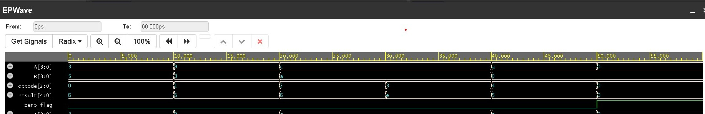

# 4-bit ALU — Verilog RTL Design & Functional Verification

**Author:** Manikandan Prabhu B  
**Tool:** EDA Playground | Icarus Verilog  
**Language:** Verilog HDL  

---

## Overview

A 4-bit Arithmetic Logic Unit (ALU) implemented in Verilog HDL for RTL  
design and functional verification practice.

The ALU supports 5 arithmetic and logic operations selected using a  
3-bit opcode and includes a zero-flag output for zero-result detection.

A functional testbench was developed to verify all operations through  
simulation using EDA Playground and EPWave.

---

## Supported Operations

| Opcode | Operation | Description       |
|--------|-----------|-------------------|
| 000    | ADD       | A + B             |
| 001    | SUB       | A - B             |
| 010    | AND       | A AND B (bitwise) |
| 011    | OR        | A OR B (bitwise)  |
| 100    | NOT       | NOT A (bitwise)   |

---

## Module Ports

| Port      | Direction | Width | Description             |
|-----------|-----------|-------|-------------------------|
| A         | Input     | 4-bit | Operand A               |
| B         | Input     | 4-bit | Operand B               |
| opcode    | Input     | 3-bit | Operation select        |
| result    | Output    | 5-bit | Result including carry  |
| zero_flag | Output    | 1-bit | HIGH when result = 0    |

---

## Testbench Verification

| Test | A    | B    | Operation | Expected Result     |
|------|------|------|-----------|---------------------|
| 1    | 0011 | 0101 | ADD       | 01000 (8)           |
| 2    | 1001 | 0011 | SUB       | 00110 (6)           |
| 3    | 1100 | 1010 | AND       | 01000               |
| 4    | 1100 | 1010 | OR        | 01110               |
| 5    | 1010 | 0000 | NOT A     | 00101               |
| 6    | 0000 | 0000 | ADD       | 00000 (zero_flag=1) |

**All 6 test cases passed successfully ✅**

---

## Simulation Waveform

Waveform verifies correct functionality of:
- Inputs `A` and `B`
- `opcode`
- `result`
- `zero_flag`

The final test case confirms zero detection (`0 + 0 = 0`) with  
`zero_flag = 1`.

---

## Key Learnings

- Writing synthesizable RTL in Verilog HDL
- Using combinational logic with `always @(*)`
- Implementing opcode-based logic using `case` statements
- Creating structured functional testbenches
- Generating and analyzing simulation waveforms in EPWave

---

## Repository Files

| File         | Description                        |
|--------------|------------------------------------|
| design.sv    | 4-bit ALU RTL design               |
| testbench.sv | Functional verification testbench  |
| waveform.png | Simulation waveform output         |

---

## How to Run

1. Open https://edaplayground.com  
2. Paste `design.sv` into the **Design** panel  
3. Paste `testbench.sv` into the **Testbench** panel  
4. Select **Icarus Verilog** as simulator  
5. Enable **Open EPWave after run**  
6. Click **Run** to simulate and view waveform  

---
